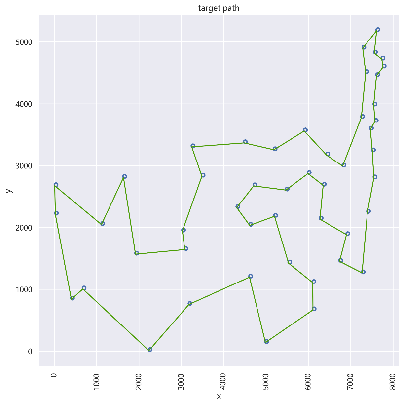
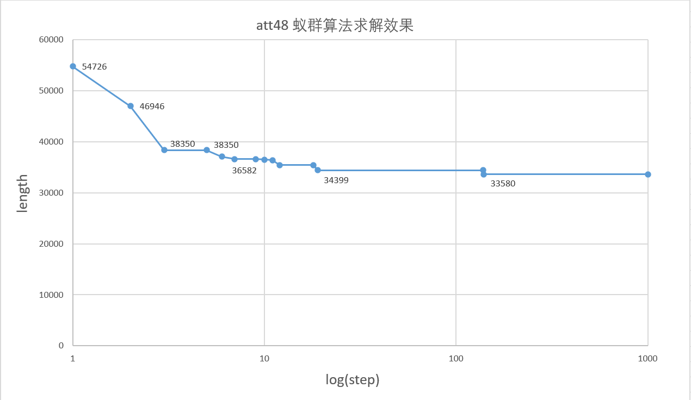
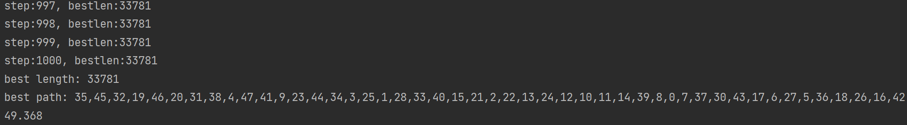

## 1. 目录结构

```
>AS
	>src
        package(myas)
            Ant
            AS
            ASMain
        package(tsp_amm)
            AdjMatrixMaker
            AMMtest
     
     >tsp_source
     	att48.tsp
```
<\b><\b>


## 2. 使用方法

​	实现了基础蚁群算法，并以 att48 问题做测试，在最优状态下可以求得最优值 33580。

使用时可直接利用 **ASMain**，需要修改：

1.  filepath（tsp问题文件路径，如 “D:/.../att48.tsp”）
2. citycount（城市数量）
3. epochs（迭代次数）


其中 **AdjMatrixMaker** 主要将 tsp 文件中城市信息转化成邻接矩阵并返回。基本使用方法：

```java
AdjMatrixMaker amm = new AdjMatrixMaker();
int[][] am = amm.TSPfile2AM(<filepath>, <citycount>);
```

**AMMtest** 用于邻接矩阵生成测试。


整个算法封装在 **AS** 中，由 **ASMain** 调度，使用方法是：

```java
AS as = new AS(<citycount>, <antcount>, <alpha>, <beta>, <rho>, <q>, <tsp adj_matrix>);
as.run(<epochs>);
as.report();
```

+ <tsp adj_matrix> tsp 城市的邻接矩阵


<\b><\b>


## 3. 测试实例

这里使用 att48.tsp 问题进行测试，在选参为

+ antcount = 600
+ alpha = 1.0
+ beta = 2.0
+ rho = 0.7
+ q = 2.0

 时跑出最佳路径（这里我是第一次这个参数就得出了，运气）。



这里因为跑出来的路径和目标路径一样，就不重复画了。收敛过程图像如下：




当然平常跑的时候不容易得到这么好的解，偶然一次跑的结果如下：



---


最后附上绘制路径的 py 代码：

```python
import matplotlib.pyplot as plt
%matplotlib inline
import seaborn as sns


sns.set()
plt.rcParams['font.sans-serif'] = ['Microsoft Yahei']  # 显示中文-微软雅黑字体
plt.figure(figsize=(10, 10), dpi=300)

sns.scatterplot(x=tspx, y=tspy, marker="$\circ$", ec="face", s=100) # 绘制空心城市原点
plt.plot(targetpathx, targetpathy, c="#4C9E07")                     # 绘制最优路径
plt.plot(mypathx, mypathy, c="#FF6262")                             # 绘制算法跑出的路径

plt.ylabel("y")
plt.xlabel("x")
plt.xticks(rotation=90) # 旋转90度
plt.show()
```

这里 tspx、targetpathx、mypathx 依次代表所有城市对应的 x 坐标、目标路径城市对应的 x 坐标、自己跑出的路径城市对应的 x 坐标，同理 ~y。


